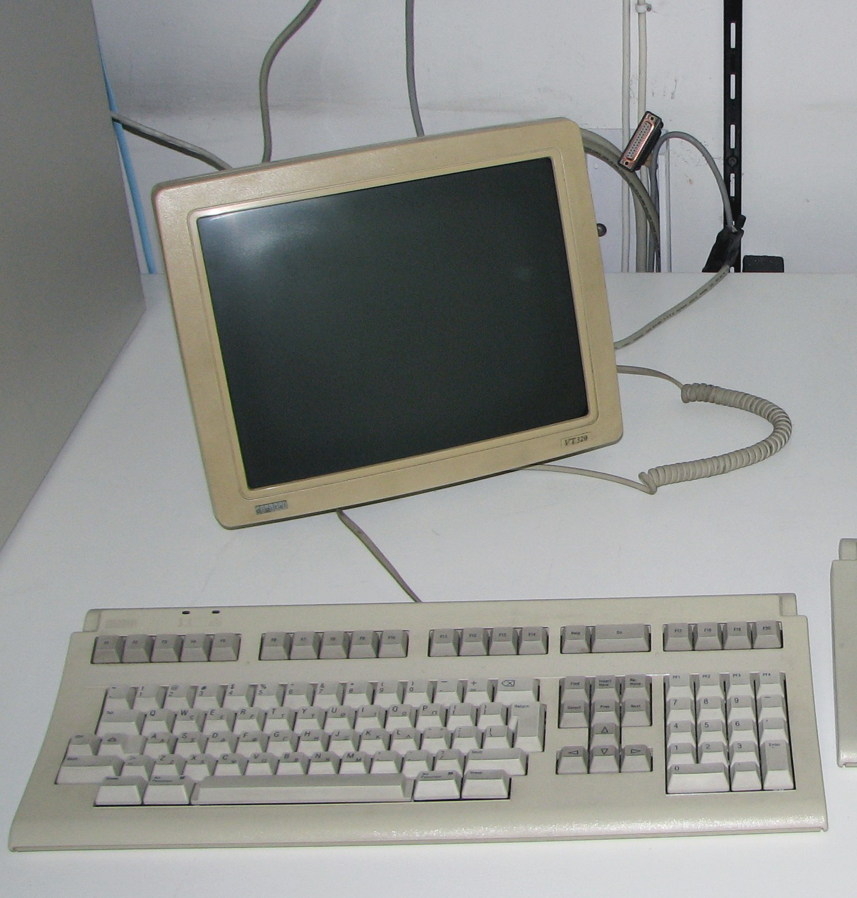
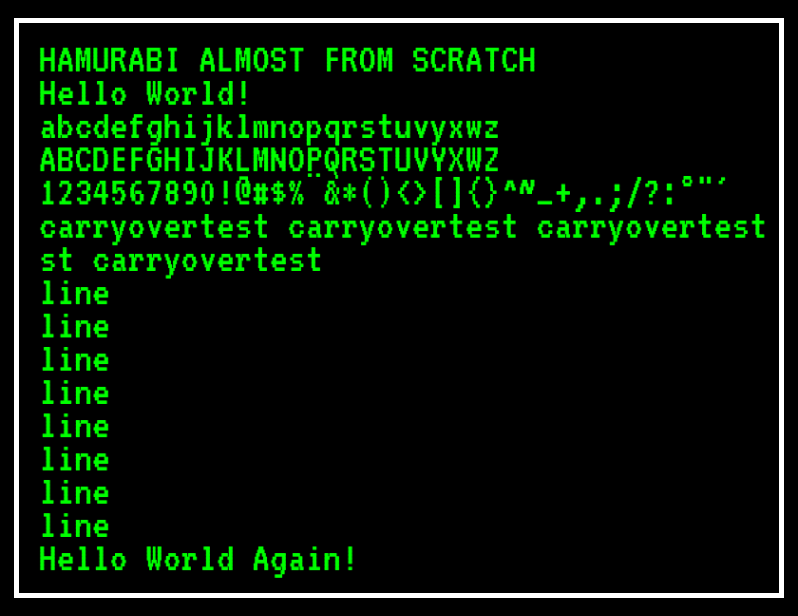
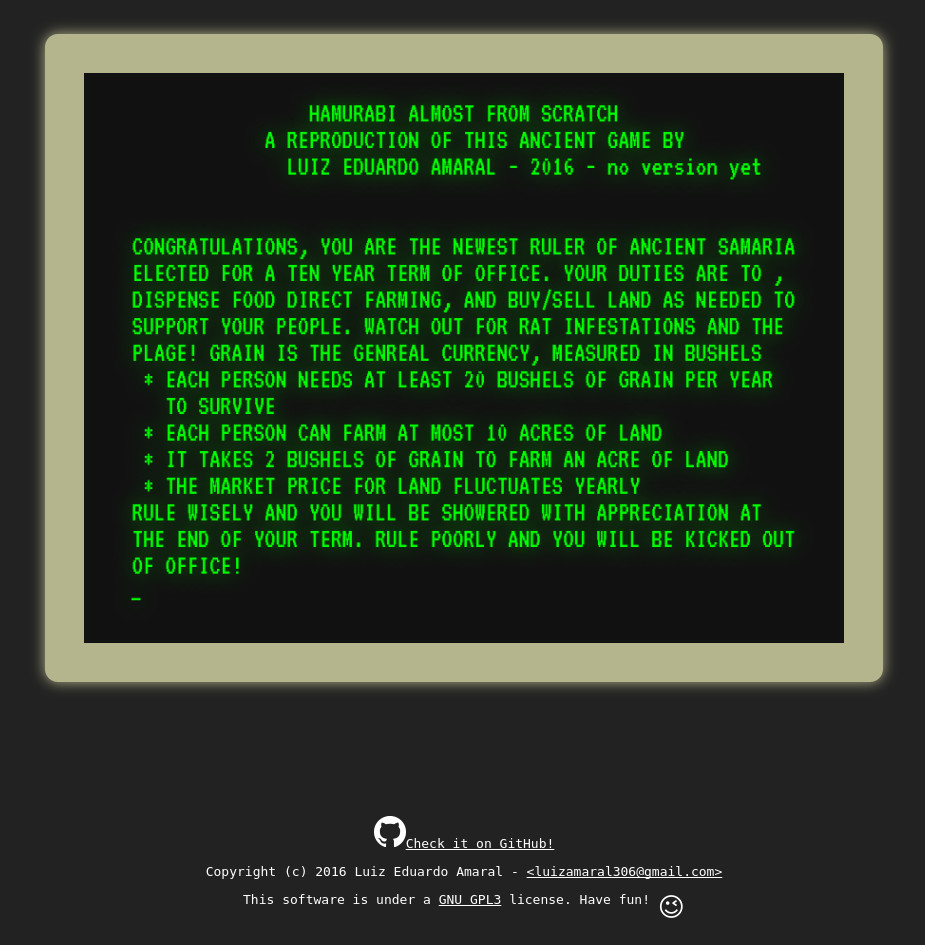

# HAMURABI ALMOST FROM SCRATCH
This is an attempt of making the game [Hamurabi](https://en.wikipedia.org/wiki/Hamurabi) using modern programming languages. The idea is to time the development and track the progress and the time it took to get in each stage in this document. If possible I want to finish this project in under 12 h.

Hamurabi is one of the first electronic games, arguably the first strategy game.
The game is set in Babylon, where the player is the ancient king [Hamurabi](https://en.wikipedia.org/wiki/Hammurabi) and must control the resources to feed the people and purchase land for a period of ten game rounds.

The game is based in html5/canvas, CSS and ES6 javascript.

#### Check it out [here](https://armlessjohn404.github.io/hamurabi-almost-from-scratch/)

## Goals
* ~~Add `LICENSE.md` and `README.md`~~
* ~~Host somewhere~~
* ~~Copy [PONG](https://armlessjohn404.github.io/pong-almost-from-scratch/) project base~~
* ~~Create drawing/writting functions~~
* ~~Research and add all the text of the game~~
* ~~Create the user input mechanics~~
* ~~Create the end round logic~~
* ~~Create game over conditions~~
* ~~Improve webpage~~
* ~~Finished!~~

## Progress reports
00:00 - START! This project has really started at November 6th, 2016 at 21:30 (BRT). I'm timing each step and will be placing the timestamp along with the achieved goal.

## 00:15 - Copied files from PONG project and hosted the page
Well, since I already made a reproduction of the game PONG, I'll be using it as a base for this project. Then I created a repository at GitHub to host the game with gh-pages.

## 01:25 - Create drawing/writting functions
I'm not really in the mood of remakinkg the old terminal fonts by hands drawing squares on screen. I already did that in [PONG](https://armlessjohn404.github.io/pong-almost-from-scratch/) and also a vector font in [spacewar](https://armlessjohn404.github.io/spacewar-almost-from-scratch/). Instead I've found a copy of a font for the [VT320](https://en.wikipedia.org/wiki/VT320) terminal in google fonts.

The text drawing function gets a text as input and prints it on screen. If the text is larger than `61` characters, the functions splits it into more lines. So far, the game looks like this:

## 08:00 - All the rest
Since there was not much action in this game, I've spent this time
just grinding with code, messing with strings and creating decision trees.
Not much fun, but it's done (for now).

I think that the most interesting part was to do some archaeology and read the original source code in BASIC. There I found some constants and text that would be harder to find just by playing the game. So thanks to http://atariarchives.org/.

I also read an [assignment](https://www.cis.upenn.edu/~matuszek/cit591-2010/Assignments/06-hammurabi.html) for the CIT 591 class of the [University of Pensylvania](http://www.upenn.edu/). It was some useful info too.

The game ended up like this:

As far as I tested there were no bugs, but only throwing it into the wild we'll find tem. So I'll be patching once if there's enough feedback.

That's it for now.
#### Bye
